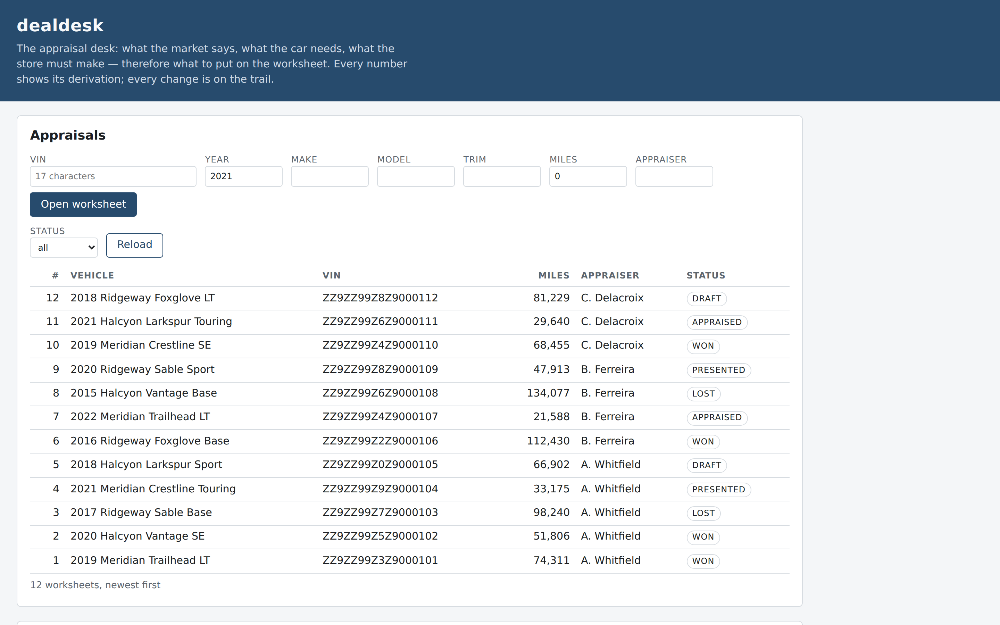

# dealdesk

[](https://github.com/HTC-56/dealdesk/actions/workflows/ci.yml)

Every used-car department runs the same arithmetic on every trade: what the
vehicle needs, what the market says, what the store must make, therefore
what to put on the worksheet. dealdesk is that appraisal desk as a small,
correct .NET 8 service — every number's derivation shown, every value change
audited, and the three reports a used-car director actually watches. Domain
math is generic, public-domain retail-automotive arithmetic. Built
end-to-end by an autonomous local-model coding loop; the commit history is
part of the deliverable. The process by which this was built is recorded in
docs/PROCESS.md.



## Requirements

- .NET 8 SDK

No database server — SQLite is a file.

## Quickstart

```bash
dotnet build
dotnet test
dotnet run --project src/DealDesk -- seed
dotnet run --project src/DealDesk
```

The service answers on `http://localhost:5000/healthz`:

```bash
curl http://localhost:5000/healthz
# {"status":"ok","schema":"005_reports"}
```

Open `http://localhost:5000/` in a browser for the desk page.

## The API

- `GET /` — the desk page: worksheet, appraisal list, audit trail and three reports
- `GET /healthz` — health check, returns schema version
- `GET /metrics` — Prometheus text: request counters and worksheet counts by status
- `POST /api/appraisals` — create a new appraisal in draft status
- `GET /api/appraisals` — list all appraisals, newest first; optional `?status=` filter
- `GET /api/appraisals/{id}` — retrieve one appraisal by id
- `GET /api/appraisals/{id}/walk-items` — condition walk lines
- `POST /api/appraisals/{id}/walk-items` — add a walk line (area must be in vocabulary)
- `GET /api/appraisals/{id}/recon-lines` — itemized recon estimate lines
- `POST /api/appraisals/{id}/recon-lines` — add a recon line (category must be in vocabulary)
- `GET /api/appraisals/{id}/comps` — hand-entered comparable sales
- `POST /api/appraisals/{id}/comps` — add a comparable sale
- `GET /api/appraisals/{id}/offer-inputs` — store numbers (pack, targetGross) plus optional anchorOverride
- `PUT /api/appraisals/{id}/offer-inputs` — upsert the store numbers
- `GET /api/appraisals/{id}/offer` — recommended trade value with its derivation
- `POST /api/appraisals/{id}/status` — move the worksheet through its lifecycle
- `PATCH /api/appraisals/{id}` — revise worksheet fields, audited
- `GET /api/appraisals/{id}/audit` — the change trail, newest first
- `GET /api/appraisals/{id}/recon-lines/{lineId}/actuals` — posted actual costs for one estimate line
- `POST /api/appraisals/{id}/recon-lines/{lineId}/actuals` — post an actual cost against that line
- `GET /api/appraisals/{id}/recon-variance` — estimate vs actual, per line and by category
- `GET /api/reports/look-to-book` — appraiser-level look-to-book rates
- `GET /api/reports/recon-variance` — cross-worksheet recon variance by category
- `GET /api/reports/front-gross` — planned gross minus recon variance, per appraiser

**Money is whole cents.** Every money field on the wire — `estimate`, `price`,
`pack`, `targetGross`, `anchorOverride`, `recommended` — is an integer number
of cents. `1550000` is $15,500.00.

**The offer carries its derivation.** `GET .../offer` returns `recommended`
together with a `derivation` array of `{label, amount, runningTotal}`; the
amounts sum to `recommended`. A worksheet with no comps and no anchor
override returns 409.

**Every change is audited.** `POST .../status` and `PATCH` require `changedBy`
and `reason`, and append one `audit_entry` row per changed field recording who,
when, old and new. The table is append-only — UPDATE and DELETE against it are
refused by the database. The lifecycle is draft → appraised → presented → won |
lost; `lost` is reachable from any open state, and a move the lifecycle refuses
is a 409.

**Recon actuals carry their variance.** Actual costs post against a recon estimate line, many per line, and `GET .../recon-variance` serves `variance = actual − estimate` for every line, rolled up by category and for the worksheet. A positive variance means the line ran over estimate. A posting may be negative — that is a credit — but never zero, and `unpostedLines` says how many lines nothing has been spent against yet.

**Three reports summarise the store.** Report routes are `GET /api/reports/...`, take no id and never 404 — an empty store is an empty report. `GET .../look-to-book` groups by appraiser, counting worksheets seen, appraised, bought and lost, with the booking rate in basis points (`2500` is 25.00%). `GET .../recon-variance` rolls every worksheet's recon lines into category rows with totals. `GET .../front-gross` counts won worksheets, subtracts recon overage from the planned gross, and flags unposted lines. Rates travel as basis points; money as whole cents.

**The ops surface is three things.** `GET /metrics` serves hand-rolled Prometheus text — request counters labelled by method and status, and a `dealdesk_appraisals` gauge counting worksheets by lifecycle status. Every request also appends one JSON line to the ops ledger (`ledger.jsonl` by default, moved with `DEALDESK_Ops__LedgerPath`), which keeps the request path the metric labels deliberately leave out. Setting `DEALDESK_Auth__Token` arms a static bearer token on writes: POST, PUT, PATCH and DELETE then need an `Authorization: Bearer` header and answer 401 without one, while reads, `/healthz` and `/metrics` stay open. Leave it unset and writes are open, as the quickstart above runs them.

`dotnet run --project src/DealDesk -- seed` writes a demo month — twelve worksheets across three invented appraisers, covering all five lifecycle states, with fifteen recon lines across every category, some posted against and some not, so the reports show real numbers on first run. Every name, VIN and price is invented, and dealdesk never looks a VIN up anywhere. The seed refuses to run a second time: a database that already holds worksheets is left exactly as it is, so nobody can write two demo months over each other.

`GET /` serves the desk page — one hand-written HTML file with its CSS and its JavaScript inline, no framework, no build step, no CDN and no web font, so the page makes no request to anywhere but this service. It shows the appraisal list with lifecycle states, one worksheet with its walk, recon lines, comps and store numbers, the offer derivation recomputed live as the desk types, the audit trail, and all three reports. The live numbers are a preview; `GET .../offer` on the server is the authority. Money is typed in dollars and travels as whole cents.

```bash
curl http://localhost:5000/api/appraisals/1/offer
```

## Layout

- `src/DealDesk/` — .NET 8 minimal API project (Program.cs, domain models, Dapper data layer)
- `sql/` — numbered, append-only migration scripts
- `tests/DealDesk.Tests/` — xUnit tests
- `scripts/` — automation (scrub-check.sh)
- `deploy/` — example systemd unit and environment file
- `docs/` — PROCESS.md, how the loop built this

## Deploy

```bash
dotnet publish -c Release -r linux-x64
```

produces one self-contained executable that carries the .NET runtime, the
migrations, the seed script and the desk page, so there is nothing to copy
beside it; another runtime identifier gives another platform.

`deploy/dealdesk.service` is an example systemd unit and
`deploy/dealdesk.env.example` is the environment file it reads, naming every
configuration key the service understands. The example binds to loopback and
a reverse proxy belongs in front of it.

## Gates

Every task must pass all four gates before committing:

```bash
dotnet build -warnaserror
dotnet test
dotnet format --verify-no-changes
bash scripts/scrub-check.sh
```
